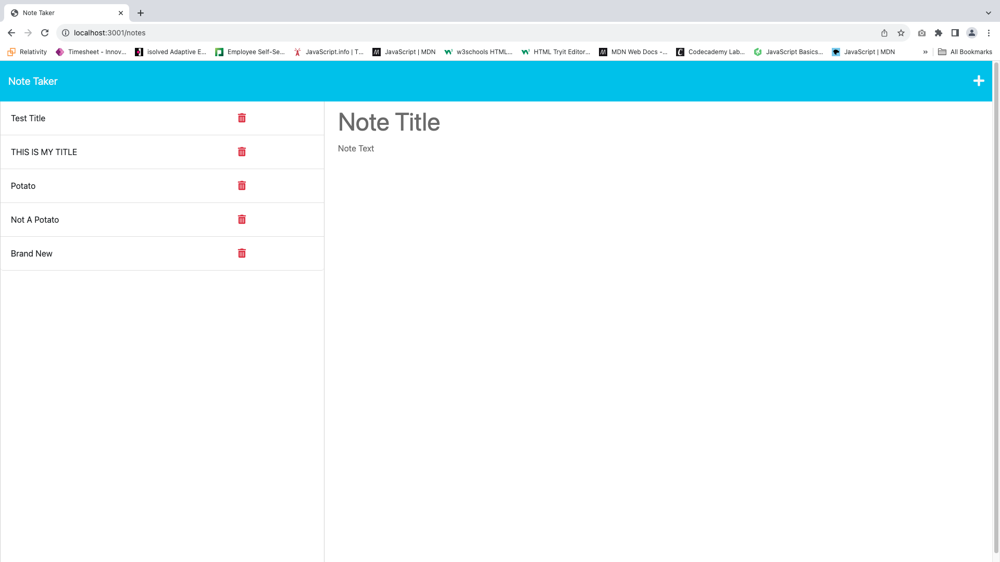

# Note-Taker

[](https://opensource.org/licenses/MIT)

## Table of Contents
1. [Description](#description)
2. [Installation](#installation)
3. [Technologies](#technologies) 
4. [Usage](#usage)
5. [Images](#images)
6. [Contributing](#contributing)
7. [Collaborators](#collaborators)
8. [Questions](#questions)
9. [License](#license)

## Description
This is a simple Note Taker application that allows users to create and view notes. It is built using Express.js on the back end and provides a user-friendly interface for taking and managing notes.

## Installation
To install this project, follow these steps:

1. Clone the repository to your local machine using the following command:
   ```
   git clone git@github.com:Augustus1110/Note-Taker.git
   ```

2. Navigate to the project directory using the command line.

3. Install the required dependencies by running:
   ```
   npm install
   ```

4. Start the application using the following command:
   ```
   npm start
   ```

5. Open your web browser and go to `http://localhost:3001` to use the Note Taker application.

## Technologies
This project utilizes the following technologies:
- HTML
- CSS
- JavaScript
- Node.js
- Express.js
- Bootstrap

## Usage
To use this project, follow these steps:

1. Launch the application by following the installation instructions above.

2. Click on the "Get Started" button on the home page to access the note-taking interface.

3. To create a new note, click the "New Note" button in the navigation bar.

4. Enter a title and the text of your note.

5. Click the floppy disk icon (save) to save the note.

6. Your saved notes will be displayed in the left sidebar. You can click on a note to view or edit it.


## Images


## Contributing
Contributions to this project are currently not being accepted. If you would like to contribute, please contact me at the email listed below.

## Collaborators
This project was completed with guidance and assistance from EdX/UC Berkeley Extension tutor, Robby Kurle. 

## Questions
If you have any questions, please contact me:

- GitHub: [Augustus1110](https://github.com/Augustus1110)
- Email: donahi22@gmail.com


## License
This project is licensed under the [MIT License](https://opensource.org/licenses/MIT).
